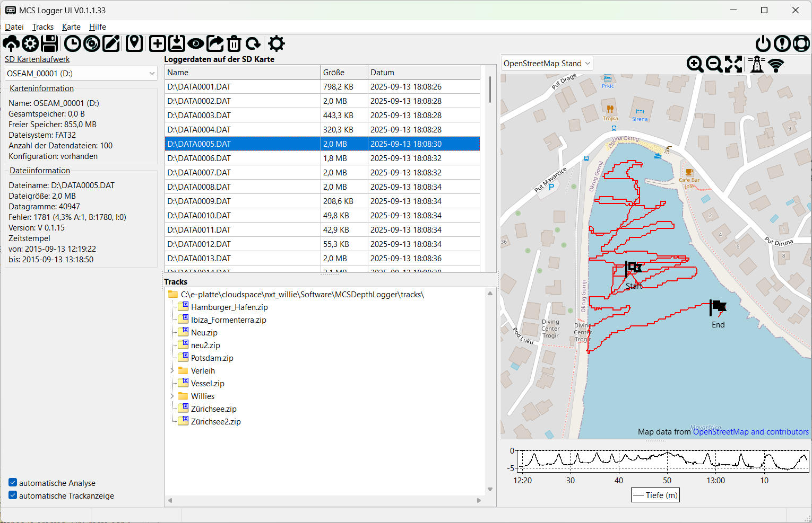

# MCS Depth Logger UI

Hallo, 

ich freue mich, dass du dich hierhin verirrst hast. Ich möchte dir gerne das neue MCS Depth Logger UI nahe bringen und dich ein bisschen durch die Funktionen führen.

Mein Name ist Willie und ich bin der Entwickler hinter dem Tool.

Zunächst aber einmal eine kurze knappe Auflistung von dem, was das Tool so kann.

## Features

- Überprüfung der Loggerdaten
  - Dateigröße
  - Anzahl der Datagramme
  - Angabe von Fehler pro Kanal 
  - Zeitstempel
- Normalisierung der Zeitbasis der Datei
- Backup und Wiederherstellung von Logger SD Karten
- Zusammenfassen von Loggerdaten zu Tracks
- Anzeige der Datendateien und Tracks auf einer Karte
- Konfiguration des Hardwareloggers

# Hauptfenster

- **SD Kartenlaufwerk:** Hier wird das aktuell ausgewählte Kartenlaufwerk angezeigt. Das Programm versucht, die SD Karte selbständig zu erkennen. D.h. für dich, lege einfach deine SD Karte in den Lesegerät ein und schon nach ein paar Sekunden sollte der der Titel der SD Karte und der Laufwerksbuchstabe in der Liste erscheinen. Dort kannst du Karten dann auswählen. Bei Karteninformationen erscheinen nun ein paar wichtige Informationen zu der Karte. Im Bereich Loggerdateien werden dann auch die vom Logger erzeugten Datendateien erscheinen.
- **Dateiinformation:** Neben dem oben bereits erwähnten Karteninformaten, werden hier Information zu der aktuell ausgewählten Datendatei angezeigt. Datendatein können sehr gross werden. Deshalb musst Du für die Anzeige der Informationen explizite eine Analyse () ausführen. Falls dein Rechner genug Leistung hat, kannst du auch die Option automatische Analyse einschalten. (Siehe Automatikoptionen)
- **Automatikoptionen:** 
  - **automatische Analyse:** bei der automatischen Analyse wird eine selektierte Datendatei automatisch analysiert und das Ergebnis in der Box Dateiinformation dargestellt. Da die Analyse etwas Zeit benötigt, kann es zu Verzögerungen kommen wenn man in den Loggerdateien scrollt.  
  - **automatische Trackanzeige:** bei der automatischen Trackanzeige wird die zuletzt angewählte Loggerdatei bzw. der zuletzt angewählte Track automatisch in der Kartenansicht dargestellt. Können keine Daten zur Darstellung extrahiert werden, wird dies unten in der Statusbar angezeigt und die Karte stellt sich wieder auf ihre Basisansicht.
- **Loggerdateien:** hier siehst du eine Aufstellung aller Loggerdateien auf deiner SD Karte. Du kannst die Größe der Spalten verändern, und du kannst durch einen einfachen Klick auf den Spaltenkopf nach dieser Spalte sortieren. Die aktuelle Sortierrichtung wird als kleiner Pfeil in dem Spaltenkopf angezeigt.
- **Trackanzeige:** Hier findest du alle deine bereits erzeugten Track. Diese sind hierachisch nach Gruppen sortiert. Jeder Track ist technisch eine ZIP Datei. Darin sind alle nötigen Informationen enthalten.
- **Karte mit Toolbar:** Hier siehst du eine Karte mit ihrer Toolbar. Näheres findest du dazu hier:  [Kartenansicht](#Kartenansicht)
- **Tiefendaten:** Hier siehst du das grafische Bodenprofil deiner Tiefendaten, sofern welche in den Daten erfasst wurden.

## Haupttoolbar

-  **Upload:** Hier gelangst du zu zu der Uploadseite des OpenSeaMap Projektes.

-  **Konfiguration Hardwarelogger:** Damit der Hardwarelogger richtig funktioniert, muss eine Konfiguration auf der SD Karte hinterlegt werden.  Mit diesem Knopf kannst du entweder die aktuelle Konfiguration bearbeiten oder eine neue erzeugen, je nachdem, ob bereits eine Konfiguration auf der Karte vorhanden war. Siehe [Logger Konfiguration](#Konfiguration)

-  **Verwaltung der SD Karten:** Hiermit erscheint der Dialog zur Verwaltung deiner SD Karten. Siehe [SD Karten Verwaltung](#Verwaltung)

- **Zeitstempel aktualisieren:** Das Programm versucht anhand der Loggerdaten in der Datei, den Zeitstempel der Datei (Änderungsdatum) auf den richtigen Wert zu setzten.

- **Track exportieren:** Hier kann der selektierte Track in ein anderes Format zur externen Verwendung exportiert werden. Siehe: [Datenexport](#Export) 

- **Daten analysieren: **startet die Datenanalyse. Die Ergebnisse werden in der Box Dateiinformation dargestellt. Siehe: [Datenanalyse](#Datenanalyse)

- **Daten ändern:** startet einen Editor, mit dem Daten geändert werden können. siehe [Dateneditor](#Dateneditor)

- **Karte:** die zuletzt markierte Datei/Track wird auf der Karte dargestellt. [Karte](#Kartenansicht) 

- **neuer Track:** Alle aktuell markierten Datendateien werden zu einem neuen Track zusammen gefasst.  Siehe: [Track erstellen](#Erstellen)

- **zu Track hinzufügen:** fügt die aktuell markierte Datendatei dem Track hinzu und aktualisiert den Gesamttrack. Siehe: [Track hinzufügen](#Daten hinzufügen)

- **Track löschen:** Löscht, nach Nachfrage, den aktuell markierten Track.

- **Tracks aktualisieren:** Aktualisiert die Ansicht der Tracks.

- **Einstellungen:** ruft den Einstellungsdialog auf. Siehe: [Einstellungen](#Einstellungen)

- **Programm beenden:** Beendet das Programm.

- **About Dialog:** zeigt den Über Dialog an. 

- **Hilfe:** zeigt diese Hilfedatei an.

## Logger

### Konfiguration

## SD Karten

### Datendateien

#### Datenanalyse

### Verwaltung

#### Backup

#### Restore

## Tracks

### Erstellen

### Daten hinzufügen

### Export

## Kartenansicht

## Dateneditor

## Einstellungen