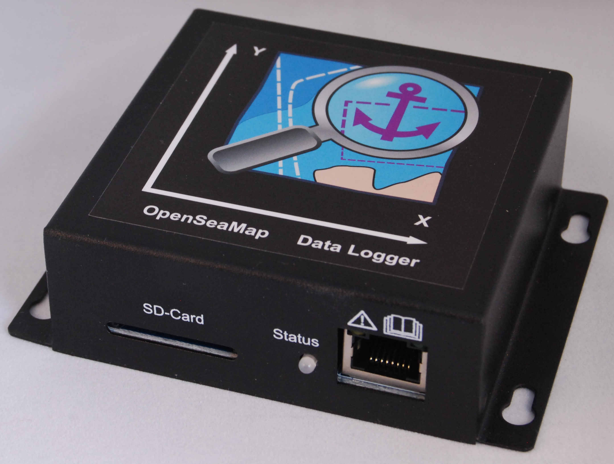
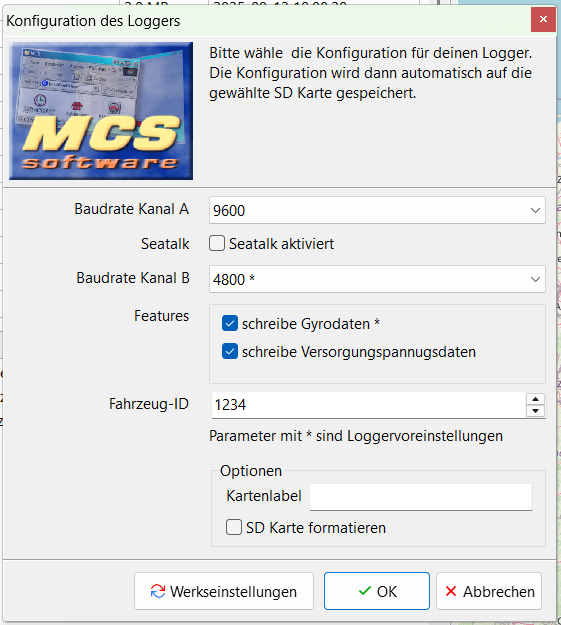
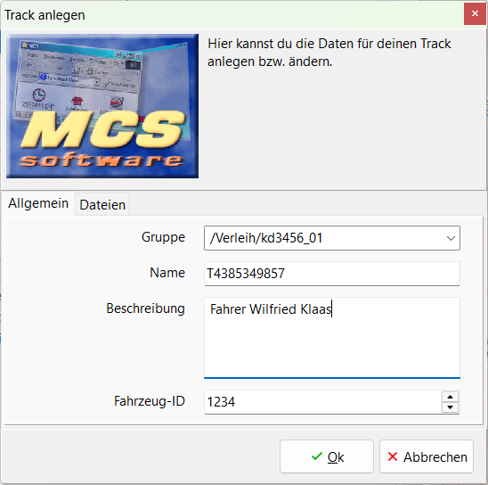
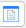
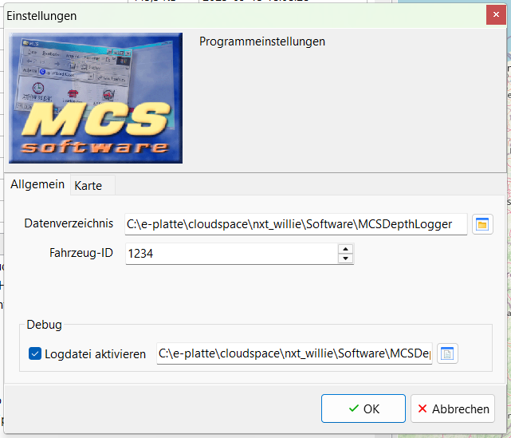

# MCS Depth Logger UI

Hallo, 

ich freue mich, dass du dich hierhin verirrst hast. Ich möchte dir gerne das neue MCS Depth Logger UI nahe bringen und dich ein bisschen durch die Funktionen führen.

Mein Name ist Willie und ich bin der Entwickler hinter dem Tool.

Zunächst aber einmal eine kurze knappe Auflistung von dem, was das Tool so kann.

## Features

- Überprüfung der Loggerdaten
  - Dateigröße
  - Anzahl der Datagramme
  - Angabe von Fehler pro Kanal 
  - Zeitstempel
- Normalisierung der Zeitbasis der Datei
- Backup und Wiederherstellung von Logger SD Karten
- Zusammenfassen von Loggerdaten zu Tracks
- Anzeige der Datendateien und Tracks auf einer Karte
- Konfiguration des Hardwareloggers

# Hauptfenster

- **SD Kartenlaufwerk:** Hier wird das aktuell ausgewählte Kartenlaufwerk angezeigt. Das Programm versucht, die SD Karte selbständig zu erkennen. D.h. für dich, lege einfach deine SD Karte in den Lesegerät ein und schon nach ein paar Sekunden sollte der der Titel der SD Karte und der Laufwerksbuchstabe in der Liste erscheinen. Dort kannst du Karten dann auswählen. Bei Karteninformationen erscheinen nun ein paar wichtige Informationen zu der Karte. Im Bereich Loggerdateien werden dann auch die vom Logger erzeugten Datendateien erscheinen.
- **Dateiinformation:** Neben dem oben bereits erwähnten Karteninformaten, werden hier Information zu der aktuell ausgewählten Datendatei angezeigt. Datendatein können sehr gross werden. Deshalb musst Du für die Anzeige der Informationen explizite eine Analyse () ausführen. Falls dein Rechner genug Leistung hat, kannst du auch die Option automatische Analyse einschalten. (Siehe Automatikoptionen)
- **Automatikoptionen:** 
  - **automatische Analyse:** bei der automatischen Analyse wird eine selektierte Datendatei automatisch analysiert und das Ergebnis in der Box Dateiinformation dargestellt. Da die Analyse etwas Zeit benötigt, kann es zu Verzögerungen kommen wenn man in den Loggerdateien scrollt.  
  - **automatische Trackanzeige:** bei der automatischen Trackanzeige wird die zuletzt angewählte Loggerdatei bzw. der zuletzt angewählte Track automatisch in der Kartenansicht dargestellt. Können keine Daten zur Darstellung extrahiert werden, wird dies unten in der Statusbar angezeigt und die Karte stellt sich wieder auf ihre Basisansicht.
- **Loggerdateien:** hier siehst du eine Aufstellung aller Loggerdateien auf deiner SD Karte. Du kannst die Größe der Spalten verändern, und du kannst durch einen einfachen Klick auf den Spaltenkopf nach dieser Spalte sortieren. Die aktuelle Sortierrichtung wird als kleiner Pfeil in dem Spaltenkopf angezeigt.
- **Trackanzeige:** Hier findest du alle deine bereits erzeugten Track. Diese sind hierachisch nach Gruppen sortiert. Jeder Track ist technisch eine ZIP Datei. Darin sind alle nötigen Informationen enthalten.
- **Karte mit Toolbar:** Hier siehst du eine Karte mit ihrer Toolbar. Näheres findest du dazu hier:  [Kartenansicht](#Kartenansicht)
- **Tiefendaten:** Hier siehst du das grafische Bodenprofil deiner Tiefendaten, sofern welche in den Daten erfasst wurden.

## Haupttoolbar

-  **Upload:** Hier gelangst du zu zu der Uploadseite des OpenSeaMap Projektes.

-  **Konfiguration Hardwarelogger:** Damit der Hardwarelogger richtig funktioniert, muss eine Konfiguration auf der SD Karte hinterlegt werden.  Mit diesem Knopf kannst du entweder die aktuelle Konfiguration bearbeiten oder eine neue erzeugen, je nachdem, ob bereits eine Konfiguration auf der Karte vorhanden war. Siehe [Logger Konfiguration](#Konfiguration)

-  **Verwaltung der SD Karten:** Hiermit erscheint der Dialog zur Verwaltung deiner SD Karten. Siehe [SD Karten Verwaltung](#Verwaltung)

- **Zeitstempel aktualisieren:** Das Programm versucht anhand der Loggerdaten in der Datei, den Zeitstempel der Datei (Änderungsdatum) auf den richtigen Wert zu setzten.

- **Track exportieren:** Hier kann der selektierte Track in ein anderes Format zur externen Verwendung exportiert werden. Siehe: [Datenexport](#Export) 

- **Daten analysieren: **startet die Datenanalyse. Die Ergebnisse werden in der Box Dateiinformation dargestellt. Siehe: [Datenanalyse](#Datenanalyse)

- **Daten ändern:** startet einen Editor, mit dem Daten geändert werden können. siehe [Dateneditor](#Dateneditor)

- **Karte:** die zuletzt markierte Datei/Track wird auf der Karte dargestellt. [Karte](#Kartenansicht) 

- **neuer Track:** Alle aktuell markierten Datendateien werden zu einem neuen Track zusammen gefasst.  Siehe: [Track erstellen](#Erstellen)

- **zu Track hinzufügen:** fügt die aktuell markierte Datendatei dem Track hinzu und aktualisiert den Gesamttrack. Siehe: [Track hinzufügen](#Daten hinzufügen)

- **Track löschen:** Löscht, nach Nachfrage, den aktuell markierten Track.

- **Tracks aktualisieren:** Aktualisiert die Ansicht der Tracks.

- **Einstellungen:** ruft den Einstellungsdialog auf. Siehe: [Einstellungen](#Einstellungen)

- **Programm beenden:** Beendet das Programm.

- **About Dialog:** zeigt den Über Dialog an. 

- **Hilfe:** zeigt diese Hilfedatei an.

## Logger

Das ist der [Hardwarelogger](https://wiki.openseamap.org/wiki/OpenSeaMap-dev:HW-logger/OSeaM-Manual). Dieser benötigt für eine Konfiguration. Diese wird auf der vorbereiteten SD Karte dem Logger zur Verfügung gestellt. Das kann einerseits über das Online-Tool erfolgen: http://rcarduino.de/doku.php?id=arduino:oseam:config 

Oder aber du verwendest die in diesem Programm eingebaute Funktion.

### Konfiguration

Zunächst musst du die Baudrate des Gerätes an Port A angeben. Falls dein Geräte Seatalk verwendet, selektiere bitte die Checkbox Seatalk, verwende zusätzlich am Anschluss A den Seatalk Treiber und steck im Geräte den Jumper um. Eine Baudrate brauchst du nicht einzustellen. Die Default Baudrate liegt bei 4800 Baud.

Auch für den Anschluss B musst du eine Baudrate einstellen. Hängt dort kein Geräte dran, wähle bitte `deaktiviert`. Der B Anschluss kann System bedingt nicht mehr als 4800 Baud.

Mit den Beiden Optionen `schreibe Gyrodaten` und `schreibe Versorgungsspannungsdaten` können zusätzliche Daten mit in die Loggerdatei geschrieben werden. Gyrodaten beinhalten Lage und Position des Fahrzeuges. Damit kann die, falls der Tiefenmesser nicht bereits eine entsprechende Anpassung hat, die tatsächliche Tiefe berechnet werden.

Versorgungsspannungsdaten dienen der Analyse von Probleme bei der Spannungsversorgung des Logger. Dieser werden für den Normalbetrieb nicht benötigt.  

**Schiffs-ID**
(optional) Wenn dein Schiff auf der OpenSeaMap Seite  registriert ist, kannst du hier deine Schiffs-ID eingeben. Diese ID wird  dann im Logger gespeichert und mit in die Datendateien geschrieben.

Über Werkseinstellungen setzt du deine gemachten Einstellungen wieder auf den Standard zurück. Mit OK werden die Daten auf die SD Karte geschrieben, Abbrechen bricht den Vorgang ab.

## SD Karten

Für den Logger werden SD Karten benötigt. Diesen müssen mit FAT32 formatiert sein. Und es muss eine gültige Konfigurationsdatei auf der Karte vorhanden sein. (Siehe: [Konfiguration](#Konfiguration)) 

Die auf der Karte vorhandenen Datendateien werden in der Dateiliste dargestellt. 

### Datendateien

Der Logger schreibt fortlaufend Datendateien in einem speziellen proprietärem Format. 

#### Datenanalyse

Wenn du eine Datei selektierst, kannst du diese Analysieren lassen. (Dabei wird die Datei komplett eingelesen und der Inhalt analysiert. In der linken Box erhältst du dann das Ergebnis der Analyse. Dazu zählt die Dateigröße und die Anzahl enthaltenen lesbarer Datagramme (NMEA Sentences). Zusätzlich wird eine Fehleranalyse gemacht und ausgegeben, wieviele Fehler es gibt, gesamt und für jeden Kanal noch einmal extra.

### Verwaltung

Mit Hilfe dieses Dialoges kannst du Backups deiner SD Karte machen. 

Hier kannst du auch alte Backup wieder zurück auf eine Karte schreiben.  

Und du kannst ein altes Backup löschen. 

 Refreshed die Ansicht und  startet den Explorer in dem Backupverzeichnis. Ein Backup kann auch auf einer anderen SD Karte (z.B: mit mehr Speicherplatz) wiederhergestellt werden. Backups sind einfache Zipdateien mit allen Dateien, die sich auf der SD Karte beim Backup befanden. (No Magic behind)

## Tracks

Du kannst mit Hilfe dieses Programm, deine Fahrten aufzeichnen und als Tracks verwalten. Da der Logger bei jedem Restart und jede Stunde eine neue Datendatei anlegt, musst du diese Daten zuerst zu einem Track zusammen fassen.  

### Erstellen

Du kannst mit Hilfe dieses Programm, deine Fahrten aufzeichnen und als Tracks verwalten. Da der Logger bei jedem Restart und jede Stunde eine neue Datendatei anlegt, musst du diese Daten zuerst zu einem Track zusammen fassen. Markiere dazu die Datendateien, die du gerne zusammenfassen möchtest und drücke auf `neuen Track erzeugen`Keine Sorge, wenn du mal eine Datei vergessen hast. Diese kannst du später immer noch hinzufügen.

Gib jetzt die erforderlichen Daten ein. Die **Gruppe** ist dabei das Verzeichnis, wo die Datei abgelegt werden soll, **Name** gibt den Tracknamen an, und ist auch gleichzeitig der Dateiname. **Beschreibung** läßt dir die Möglichkeit für den Track eine Beschreibung anzugeben. Die **Schiffs-ID** ist wiederum später wichtig, wenn du Tracks zu OpenSeaMap hochladen möchtest. Alle diese Daten werden in der Trackdatei (auch eine einfache ZIP Datei) als `track.json` gespeichert. Weiterhin sind alle ausgewählten Datendatei in der ZIP enthalten und eine spezielle `track.nmea` Datei, die alle relevanten Daten für diesen Track enthält.

### Daten hinzufügen

Solltest du doch einmal eine oder mehrere Datendateien vergessen haben, ist das kein Problem. Markiere den gewünschten Track und die fehlenden Daten und drück auf  und schon werden die Daten dem Track hinzugefügt.

### Export

Über den Export Knopf  kannst du deinen Track in ein anderes Format exportieren. Möglich sind folgende Formate: GPX, KML, GEOJSON, NMEA und ein eigenes proprietäres JSON-Format. 

Oben im Dialog steht noch einmal der Name des Tracks. Dann folgt eine Box mit den möglichen Formaten. Darunter kannst du die Ausgabedatei festlegen. Über den  Knopf kannst du dir das Verzeichnis und den Dateinamen aussuchen.

## Kartenansicht

In der Kartenansicht kannst du dir die gesammelten Daten anschauen. Du kannst auch mehrere Dateien markieren und mit dem  Knopf anzeigen lassen. Oder du wählst einen Track aus und schaust dir das Ergebnis an. In der Ausklappliste oben Links findest du verschiedene Kartendienste.

In der gleichen Zeile findest du noch die Zoom-Tasten () sowie einen Knopf, um die Karte auf den Ausschnitt des Tracks zurück zu stellen.  

Danach folgen verschiedene Kartenoverlays. Zunächst der Seamark Layer, der Seezeichen, also Tonnen, Leuchttürme usw. enthält. 

 ist der Sportslayer von OpenSeaMap.

Mit  wird der Seetiefenlayer gestartet. Dieser Service ist im Gegensatz zu allen anderen kein klassischer TMS Service, sonder ein sog. WMS Service. Um diesen darzustellen wird automatisch ein kleines Programm gestartet, gomapproxy, dass zwischen der Kartenansicht und dem Server vermittelt. Wenn dieses Programm läuft, wird in der Statusbar ebenfalls ein  dargestellt.  

In der Mitte sieht man natürlich die Karte. Und wenn man einen Track aktiv hat, wird dieser auf der Karte dargestellt. 

Start und Ende werden mit kleinen Fähnchen markiert. Unausgefüllt für den Start und schwarz für das Ende des Tracks.

Unter dem Track befindet sich dann die Tiefenansicht. Du kannst, wie auch bei anderen Elementen in der Oberfläche die Größe des Elementes einstellen. Dazu gibt es zwischen der Karte und der Tiefenanzeige einen kleinen Schieber (das Dingen mit den kleinen Punkten) Auf der X-Asche siehst du die Uhrzeiten auf der Y-Achse die jeweilige Wassertiefe. (Normalerweise im negativen Bereich)

## Dateneditor

Möchtest du eine Datendatei editieren oder dir anschauen, geht das mit dem Knopf. 

Hier siehst du einen einfachen Texteditor. Du kannst jetzt die Datei editieren. Mit OK speicherst du die Datei. Abbrechen schließt den Editor ohne zu speichern. Mit neu laden kannst du die Datei erneut laden. Deine Änderungen sind dann natürlich weg.

## Einstellungen

In die Einstellungen gelangst du mit dem Knopf. 

Es gibt verschiedene Reiter mit Einstellungen. 

Allgemein enthält allgemeine Einstellungen zum Programm. Hier findest du das grundlegende Datenverzeichnis. Hier werden alle deine Daten, wie Backups, Tracks, temporäre Daten gespeichert. 

Schiffs-ID: Wenn du bereits auf OpenSeaMap dein Fahrzeug registriert hast, kannst du hier deine ID hinter legen. Diese wird dann, bei den verschiedenen Funktionen verwendet.  

Debug: Mit Logdatei aktivieren sagst du dem Programm das es eine zusätzlich Datei mit Logdaten erzeugen soll. Das kann bei der Fehlersuche helfen.  

Auf dem Reiter Karten gibt es Einstellungen zur Kartenansicht. 

Kachelalter: Aus Performanzgründen werden die Anzeigeelemente der Karte (Kacheln genannt) zwischen gespeichert. Mit dieser Einstellung kannst du bestimmen, wie alt die Kacheln maximal sein dürfen. Den Speicherort für diese Kacheln findest du im Datenverzeichnis unter `tilescache`. 

# Epilog

So nun hab ich dir die wichtigsten Dinge in dem Programm gezeigt. 

Falls du weitere Fragen hast, oder du auf einen Programm-Fehler gestoßen bist, dann meld dich doch einfach hier: https://github.com/willie68/MCSDepthLoggerUI/issues

Neue Versionen gibt es hier unter Releases: https://github.com/willie68/MCSDepthLoggerUI

Und nun wünsche ich dir noch viel Spaß.

Willie